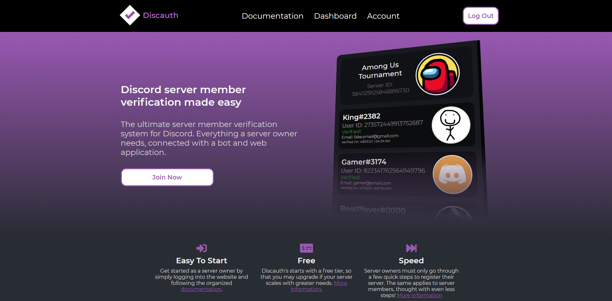
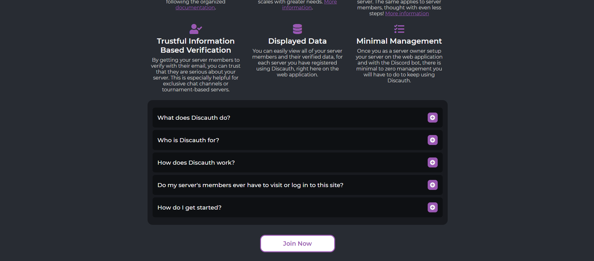
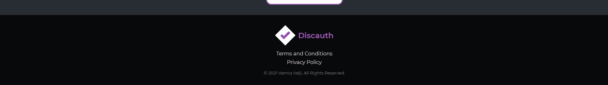
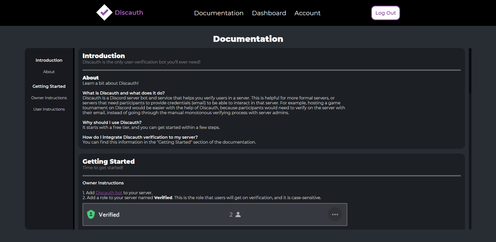
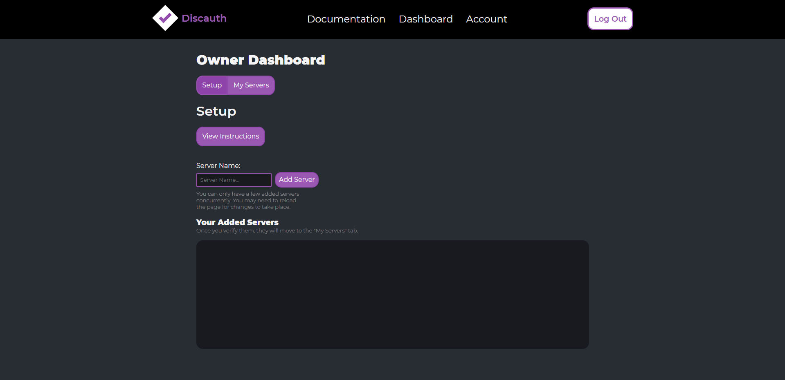
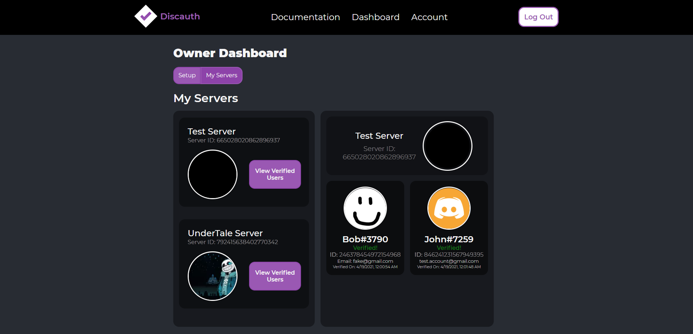
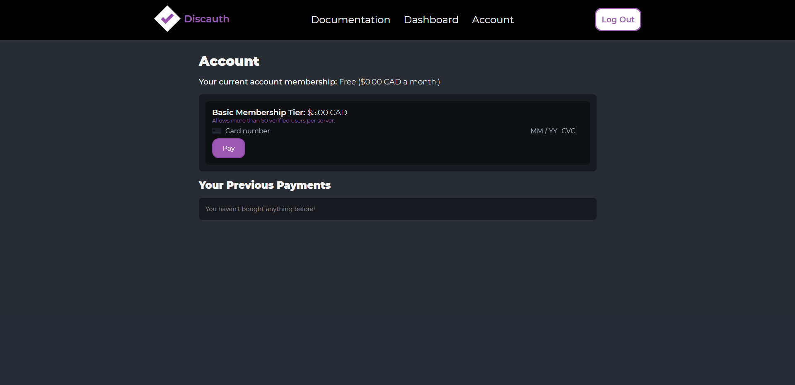
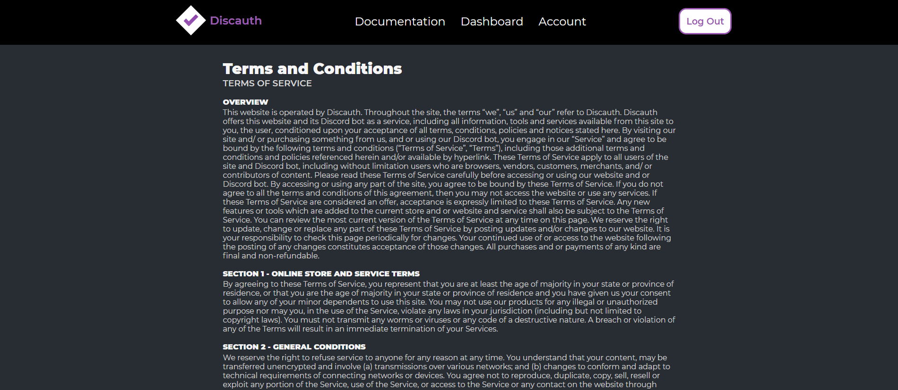
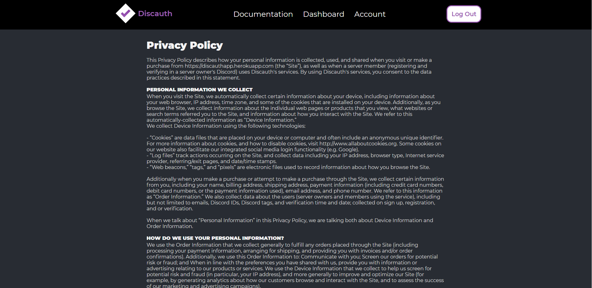

# Discauth

Discauth is the ultimate server member verification system for Discord. It is everything a server owner needs, connected with a bot and web application.

This project was created using the MERNG stack with TypeScript.

### Notes:

When viewing the Heroku page, please be patient as the web dyno the website is being hosted on may be starting up as you access it.
The bot is currently down as this project has no funding.
The bot component to Discauth is further updated under a seperate private repository. The version in this repository is outdated.

## Screenshots

> Home Page
> 
> Home Page Continued
> 
> Footer
> 
> Documentation Page
> 
> Dashboard Page (Setup Tab)
> 
> Dashboard Page (My Servers Tab)
> 
> Account Page
> 
> Login & Log Out Component
> 
> Terms of Service Page
> 
> Privacy Policy Page
> 

This project may be further updated.

Version: 1.0

- Vamiq Valji
